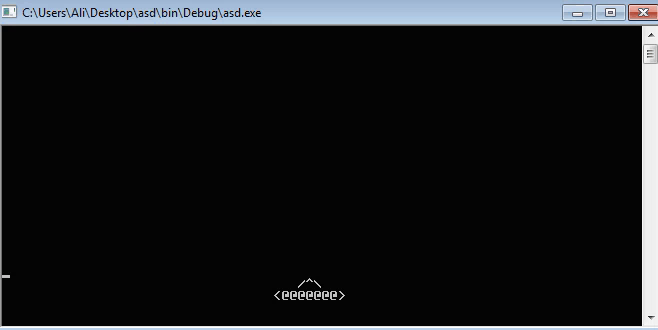

 

# Game shatel by C

 
## The game is not complete, I will be happy if you complete it
 
### (The Tasks) 
- [x] Environment preparation
- [x] Build a shatel and move
- [x] Shuttle shooting
- [ ] Build the enemy
- [ ] Logical calculations
- [ ] Show points and health and shot
- [ ] Add multi-threaded processing
